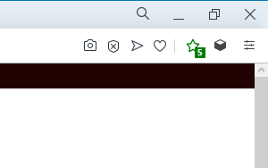

# [Sites-reviews.com](https://sites-reviews.com) webextension

> Webextension for Chrome, Firefox, Opera, Edge. 

## Features

- Shows the average rating of the site that is open in the current browser tab, in the browser icon:
- When you click on the icon you can go to the site page and read reviews about the site.



## How to install

You must have [npm](https://www.npmjs.com/) installed.
Run the command:
```
npm install
```

## How to create build

Run the command:
```
npm build
```

The ```distribution``` folder will contain the compiled extension

## How to test

Run the command:
```
npm run test
```

## Extensions created using this template

- [notlmn/browser-extension-template](https://github.com/notlmn/browser-extension-template) - Browser extension to copy hyperlinks, images, and selected text as Markdown.

## License

[](https://creativecommons.org/publicdomain/zero/1.0/)

